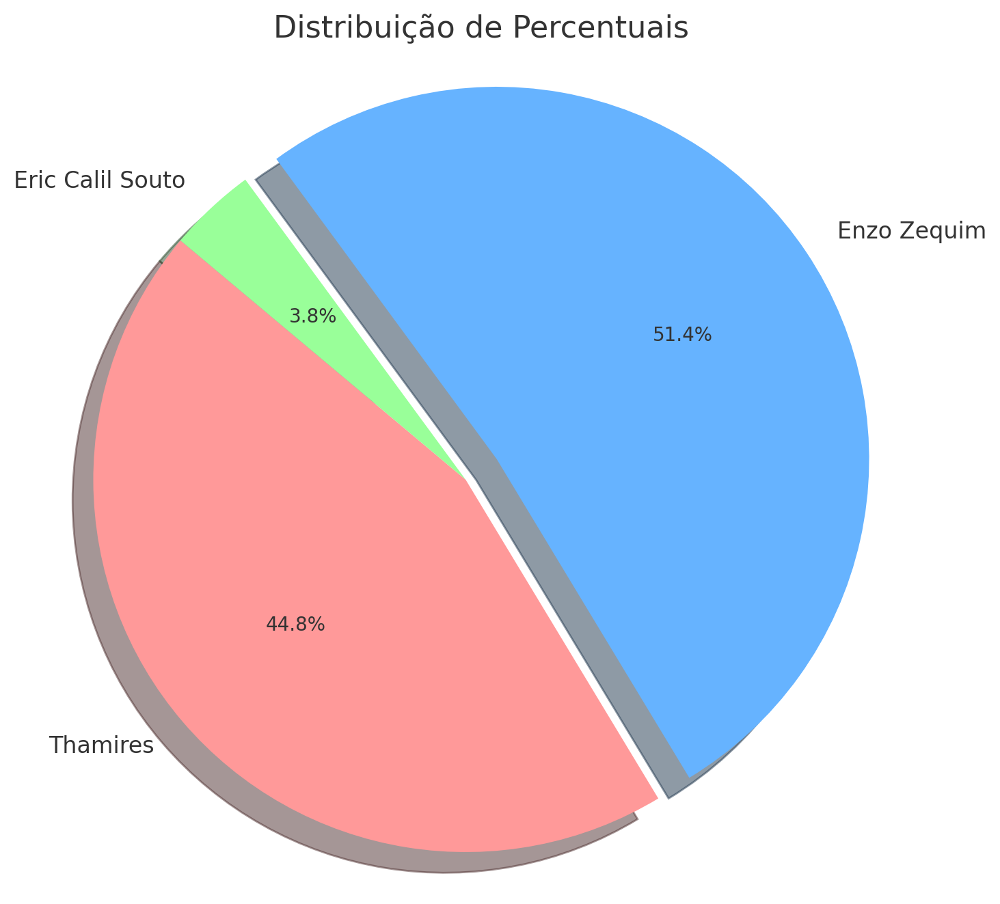

# **Usina Eco-Cultural Front-End**
Esse projeto foi desenvolvido pelos alunos do IMT, para o parceiro Usina Eco-Cultural:

1. **Enzo R. Zequim (RA: 24.00085-0)**
   **Conção Principal:** Documentação e BackEnd
    - **Documentação:**
    - Itens 1 a 4 e 8 a 10. Com a Thamires
    
   **Contribuições no Codigo:**  
    - **Pasta <ins>Backend</ins>:**
    
      - **<ins>BackEnd.js</ins> (Tudo):**
    
      - **<ins>Cadastro.js (Tudo)</ins>:**
    
      - **<ins>Eventos.js</ins>:**
          - Tudo exceto parte visual (HTML)
    
      - **<ins>Login.js (Tudo)</ins>**
    
      - **<ins>Loja.js</ins>**
        - Tudo exceto parte visual (HTML)
    
      - **<ins>Noticias.js</ins>:**
        - Tudo exceto parte visual (HTML)
    
    - **Pasta <ins>front</ins>:**
      - **Pasta <ins>Componetes</ins>:**
    
        - **<ins>navbar.js:</ins>**
          - Funções: (verificarLogin, logout, criarBotaoDropdown)
    
        - **<ins>painel-adm.js</ins>:**
          -Funções Cadastro: (CadastrarEvento, CadastrarNoticia, CadastrarProduto)  
      
    - **Pasta <ins>pages</ins>:**
      - Implementou Backend no Frontend
      - Encontrou e corrigiu erros (Icon, responsividade e outros)
      
  - **FrontEnd.js**
    - Validar ADM
    - Token
    - Readme.md 

2. **Eric Calil Souto (RA: 24.00941-5)**
   **Conção Principal:** Prototipação
    - **Design:**
      - Fez o Figma
    - **Documentação:**
      - Itens 5, 6 e 7
    
   **Contribuições no Codigo:**      
    - **Pasta <ins>Backend</ins>:**
      - **<ins>Noticias.js:</ins>:**
        - parte visual
         
    - **Pasta <ins>front</ins>:**
      - **Pasta <ins>Componetes</ins>:**    
        - **<ins>footer.js:</ins>**
          - Parte Visual
         
    - **Pasta <ins>pages</ins>:**
      - **<ins>home.html:</ins>**
        - Fez Pop-Up de natal
        - Refez parte visual
      
  - **FrontEnd.js**
    - Acessibilidade
    - Visual PopUp

3. **Thamires Pietra Menezes dos Santos (RA: 24.00872-9)**
   **Conção Principal:** Documentação e FrontEnd
    - **Documentação:**
    - Ajudou com os itens 1 a 4 e 8 a 10.
    
   **Contribuições no Codigo:**  
    - **Pasta <ins>Backend</ins>:**
    
      - **<ins>add-colaborador.js (Tudo):**
    
      - **<ins>CArrinho.js (Tudo)</ins>:**
    
      - **<ins>Eventos.js</ins>:**
          - Parte visual (HTML)    
      - **<ins>Loja.js</ins>**
        - Parte visual (HTML)
    
      - **<ins>Noticias.js</ins>:**
        - Parte visual (HTML)
    
    - **Pasta <ins>front</ins>:**
      - **Pasta <ins>Componetes</ins>:**
        
        - **<ins>footer.js:</ins>**
        - Fes parte funcional (botões e redirecionamento)
          
        - **<ins>navbar.js:</ins>**
          -Tudo eceto funções: (verificarLogin, logout, criarBotaoDropdown)
    
        - **<ins>painel-adm.js</ins>:**
          -Tudo eceto funções Cadastro: (CadastrarEvento, CadastrarNoticia, CadastrarProduto)  

        - **<ins>termos-de-uso.js (Tudo)</ins>**
      
    - **Pasta <ins>pages</ins>:**
      - **<ins>cadastro.html (Tudo)</ins>**
      - **<ins>carrinho.html (Tudo)</ins>**
      - **<ins>Contato.html (Tudo)</ins>**
      - **<ins>eventos.html (Tudo)</ins>**
       
      - **<ins>home.html:</ins>** 
        - Parte Funcional (botões e redirecionamento funcionar)
      
      - **<ins>login.html (Tudo)</ins>**
      - **<ins>loja.html (Tudo)</ins>**
      - **<ins>painel-adm.html (Tudo)</ins>**
       
  - **FrontEnd.js**
    - Funcional PopUb

### Porcentegem de commits de cada membro:

## **Requisitos**
Antes de rodar o código, verifique se você tem os seguintes itens instalados no seu computador, e atualizados:

[Visual Studio Code](https://code.visualstudio.com/)  
[Gir Hub](https://desktop.github.com/download/)  
[Git Bash](https://gitforwindows.org/)  
[Node.js](https://nodejs.org)  

### Abra o Visual Studio Code:
No VS Code navegue até uma pasta vazia no seu computador.
Abra o terminal integrado do VS Code e execute o seguinte comando para clonar o repositório:  
`git clone https://github.com/EnzoRZequim/Usina-Eco-Cultural-front-end.git`

Se prefifrir não usar o git, você pode baixar o projeto .zip no link do github

**Instalando Dependências:**  
Após clonar o repositório, siga estas etapas para instalar as dependências:
No VS Code, dentro da pasta do projeto abra o terminar execute o seguinte comando para baixar os componentes usados no projeto:  
`npm install --legacy-peer-deps`

**Iniciando o Servidor**
Para iniciar o servidor, abra o arquivo 'home.html' e execute o seguinte comando no terminal:  
`npm start`

**Instale a extensão "Live Server".**

Para abrir o projeto no seu navegador, utilize a extensão "Live Server" no Visual Studio Code:

Instale a extensão "Live Server".
Após a instalação, um botão chamado "Go Live" aparecerá na parte inferior direita do VS Code.
Clique em "Go Live" para abrir o projeto no seu navegador padrão.
Agora você poderá testar o site!